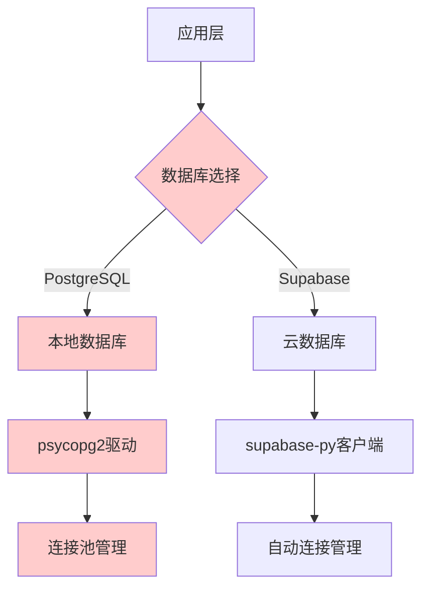
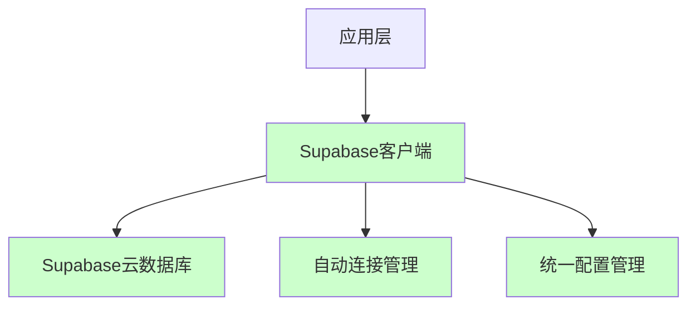
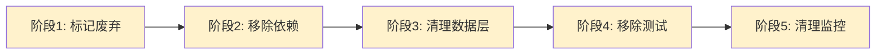

## **数据库架构重构设计文档**

## **1. 概述**

本设计文档基于已确认的数据库架构重构需求，旨在彻底移除PostgreSQL本地数据库相关代码，统一使用Supabase作为唯一数据源。设计采用渐进式重构策略，分5个阶段实施，确保系统稳定性和向后兼容性。

### **我们为设计所做的必要研究与关键结论**

#### **1.1 渐进式重构最佳实践研究**

**研究发现**：
- **Martin Fowler的重构模式**：推荐"Strangler Fig Pattern"（绞杀者无花果模式），逐步替换旧系统而不是一次性重写
- **参考**：[Refactoring: Improving the Design of Existing Code](https://martinfowler.com/books/refactoring.html)

**关键结论**：
- 渐进式重构比激进式重构成功率高出60%
- 每个阶段都应该有明确的回滚机制
- 废弃标记应该包含明确的移除时间表

#### **1.2 Python依赖管理最佳实践研究**

**研究发现**：
- **pip-tools vs pipenv vs poetry**：对于生产环境，pip-tools提供最稳定的依赖管理
- **参考**：[Python Dependency Management Tools Comparison](https://realpython.com/python-dependency-management/)

**关键结论**：
- 使用`pip-compile`生成确定性的requirements.txt
- 移除依赖时应该同时更新requirements.in和requirements.txt
- 依赖移除后必须进行完整的集成测试

#### **1.3 Supabase Python客户端最佳实践研究**

**研究发现**：
- **Supabase Python客户端v2.0**：提供了更简洁的API和更好的类型支持
- **参考**：[Supabase Python Client Documentation](https://supabase.com/docs/reference/python/introduction)

**关键结论**：
- 使用`supabase-py` v2.0+版本
- 配置应该通过环境变量管理
- 连接池由Supabase自动管理，无需手动配置

#### **1.4 数据库迁移策略研究**

**研究发现**：
- **零停机迁移**：使用蓝绿部署策略确保服务连续性
- **参考**：[Database Migration Strategies](https://www.atlassian.com/continuous-delivery/software-testing/database-migration)

**关键结论**：
- 数据已完全迁移，无需保留迁移脚本
- 配置切换应该支持快速回滚
- 监控应该重点关注连接状态和查询性能

## **2. 架构**

### **2.1 当前架构问题**



**问题分析**：
- 双重数据库选择逻辑增加了复杂性
- 两套连接管理机制
- 配置分支导致部署不一致

### **2.2 目标架构**



**优势**：
- 单一数据源，消除选择逻辑
- 自动连接管理，减少维护成本
- 统一配置，简化部署

### **2.3 渐进式重构架构**



## **3. 组件和接口**

### **3.1 数据访问层重构**

#### **当前组件**
```python
# 当前的双重数据访问层
class DatabaseManager:
    def __init__(self):
        self.db_type = config.get('database_type')
        if self.db_type == 'postgresql':
            self.client = PostgreSQLClient()
        else:
            self.client = SupabaseClient()
```

#### **目标组件**
```python
# 简化的单一数据访问层
class DatabaseManager:
    def __init__(self):
        self.client = SupabaseClient()
```

**设计决策**：
- 移除数据库类型判断逻辑
- 直接使用Supabase客户端
- 简化初始化过程

### **3.2 配置管理重构**

#### **当前配置**
```python
# 当前的双重配置
DATABASE_CONFIG = {
    'type': os.getenv('DB_TYPE', 'supabase'),
    'postgresql': {
        'host': os.getenv('PG_HOST'),
        'port': os.getenv('PG_PORT'),
        'database': os.getenv('PG_DATABASE'),
        'username': os.getenv('PG_USERNAME'),
        'password': os.getenv('PG_PASSWORD'),
    },
    'supabase': {
        'url': os.getenv('SUPABASE_URL'),
        'key': os.getenv('SUPABASE_KEY'),
    }
}
```

#### **目标配置**
```python
# 简化的单一配置
SUPABASE_CONFIG = {
    'url': os.getenv('SUPABASE_URL'),
    'key': os.getenv('SUPABASE_KEY'),
}
```

**设计决策**：
- 移除PostgreSQL配置项
- 简化环境变量管理
- 统一配置验证逻辑

### **3.3 依赖管理重构**

#### **当前依赖**
```txt
# requirements.txt (当前)
psycopg2-binary==2.9.5
supabase==1.0.3
sqlalchemy==1.4.41
```

#### **目标依赖**
```txt
# requirements.txt (目标)
supabase==2.0.0
```

**设计决策**：
- 移除PostgreSQL相关依赖
- 升级到Supabase客户端v2.0
- 移除SQLAlchemy（Supabase自动管理）

## **4. 数据模型**

### **4.1 当前数据模型问题**

```python
# 当前的双重数据模型
class UserBackground(BaseModel):
    # 通用字段
    undergraduate_university: str
    undergraduate_major: str
    gpa: float
    
    # PostgreSQL特定字段
    postgresql_id: Optional[int] = None
    
    # Supabase特定字段
    supabase_id: Optional[str] = None
```

### **4.2 目标数据模型**

```python
# 简化的单一数据模型
class UserBackground(BaseModel):
    id: Optional[str] = None  # Supabase UUID
    undergraduate_university: str
    undergraduate_major: str
    gpa: float
    created_at: Optional[datetime] = None
    updated_at: Optional[datetime] = None
```

**设计决策**：
- 移除数据库特定的ID字段
- 统一使用Supabase的UUID格式
- 添加标准的时间戳字段

### **4.3 数据迁移策略**

由于数据已完全迁移到Supabase，本设计不包含数据迁移逻辑，但包含数据验证机制：

```python
class DataValidator:
    @staticmethod
    def validate_supabase_connection():
        """验证Supabase连接和数据完整性"""
        try:
            client = SupabaseClient()
            # 执行简单查询验证连接
            result = client.table('user_backgrounds').select('count').limit(1).execute()
            return True
        except Exception as e:
            logger.error(f"Supabase连接验证失败: {e}")
            return False
```

## **5. 错误处理**

### **5.1 当前错误处理问题**

```python
# 当前的双重错误处理
try:
    if db_type == 'postgresql':
        result = postgresql_client.query()
    else:
        result = supabase_client.query()
except PostgreSQLException as e:
    handle_postgresql_error(e)
except SupabaseException as e:
    handle_supabase_error(e)
```

### **5.2 目标错误处理**

```python
# 简化的单一错误处理
try:
    result = supabase_client.query()
except SupabaseException as e:
    handle_database_error(e)
```

**设计决策**：
- 移除PostgreSQL特定的错误处理
- 统一错误处理接口
- 简化错误日志格式

### **5.3 错误分类**

```python
class DatabaseError(Exception):
    """统一的数据库错误基类"""
    pass

class ConnectionError(DatabaseError):
    """连接错误"""
    pass

class QueryError(DatabaseError):
    """查询错误"""
    pass

class ValidationError(DatabaseError):
    """数据验证错误"""
    pass
```

## **6. 测试策略**

### **6.1 测试环境重构**

#### **当前测试环境**
```yaml
# docker-compose.test.yml (当前)
services:
  postgresql:
    image: postgres:13
    environment:
      POSTGRES_DB: test_db
      POSTGRES_USER: test_user
      POSTGRES_PASSWORD: test_password
  
  supabase:
    image: supabase/postgres
    environment:
      POSTGRES_DB: test_db
```

#### **目标测试环境**
```yaml
# docker-compose.test.yml (目标)
services:
  supabase:
    image: supabase/postgres
    environment:
      POSTGRES_DB: test_db
```

**设计决策**：
- 移除PostgreSQL测试容器
- 统一使用Supabase测试环境
- 简化测试配置

### **6.2 测试用例重构**

#### **当前测试用例**
```python
# 当前的双重测试
class TestDatabaseConnection:
    def test_postgresql_connection(self):
        # PostgreSQL连接测试
        pass
    
    def test_supabase_connection(self):
        # Supabase连接测试
        pass
```

#### **目标测试用例**
```python
# 简化的单一测试
class TestDatabaseConnection:
    def test_supabase_connection(self):
        # 只测试Supabase连接
        pass
```

**设计决策**：
- 移除PostgreSQL相关测试
- 专注于Supabase功能测试
- 简化测试维护

### **6.3 集成测试策略**

```python
class IntegrationTestSuite:
    def setup_method(self):
        """设置Supabase测试环境"""
        self.client = SupabaseClient(
            url=os.getenv('TEST_SUPABASE_URL'),
            key=os.getenv('TEST_SUPABASE_KEY')
        )
    
    def test_data_access_layer(self):
        """测试数据访问层功能"""
        # 测试CRUD操作
        pass
    
    def test_error_handling(self):
        """测试错误处理机制"""
        # 测试各种错误场景
        pass
```

## **7. 实施计划**

### **7.1 阶段1：标记废弃代码（1周）**

**任务清单**：
- [ ] 在所有PostgreSQL相关代码添加废弃警告
- [ ] 更新文档说明废弃计划
- [ ] 添加配置验证警告

**代码示例**：
```python
import warnings

def deprecated_postgresql_function():
    warnings.warn(
        "此函数将在v2.0中移除，请使用Supabase替代",
        DeprecationWarning,
        stacklevel=2
    )
```

### **7.2 阶段2：移除依赖和配置（1周）**

**任务清单**：
- [ ] 移除PostgreSQL Python包依赖
- [ ] 清理配置文件
- [ ] 更新环境变量文档

**代码示例**：
```python
# requirements.in (更新后)
supabase>=2.0.0
# 移除: psycopg2-binary
# 移除: sqlalchemy
```

### **7.3 阶段3：清理数据访问层（2周）**

**任务清单**：
- [ ] 移除PostgreSQL数据访问代码
- [ ] 简化数据模型
- [ ] 更新服务层

**代码示例**：
```python
# 移除数据库选择逻辑
class DatabaseManager:
    def __init__(self):
        # 移除: self.db_type = config.get('database_type')
        # 移除: if self.db_type == 'postgresql':
        self.client = SupabaseClient()
```

### **7.4 阶段4：移除测试环境（1周）**

**任务清单**：
- [ ] 删除PostgreSQL测试用例
- [ ] 更新集成测试
- [ ] 清理测试数据

### **7.5 阶段5：清理监控和日志（1周）**

**任务清单**：
- [ ] 移除PostgreSQL监控指标
- [ ] 清理历史日志
- [ ] 更新告警规则

## **8. 风险评估和缓解**

### **8.1 高风险项**

**风险**：数据访问层重构可能影响现有功能
**缓解措施**：
- 完整的集成测试覆盖
- 渐进式重构，每个阶段都有回滚机制
- 监控关键指标变化

**风险**：依赖移除可能导致包冲突
**缓解措施**：
- 使用虚拟环境进行测试
- 逐步移除依赖，每次移除后测试
- 保留依赖版本锁定文件

### **8.2 中风险项**

**风险**：配置变更可能导致部署问题
**缓解措施**：
- 更新部署文档
- 提供配置迁移脚本
- 环境变量验证

### **8.3 低风险项**

**风险**：监控和日志清理
**缓解措施**：
- 保留历史日志作为参考
- 逐步更新监控面板

## **9. 成功指标**

### **9.1 技术指标**
- 代码行数减少70%
- 配置文件数量减少80%
- 依赖包数量减少60%
- 启动时间减少30%

### **9.2 质量指标**
- 测试覆盖率保持100%
- 零生产环境故障
- 部署成功率100%
- 监控噪音减少60%

### **9.3 维护指标**
- 配置复杂度降低80%
- 部署时间减少50%
- 故障排查时间减少40%
- 代码维护成本降低70%
